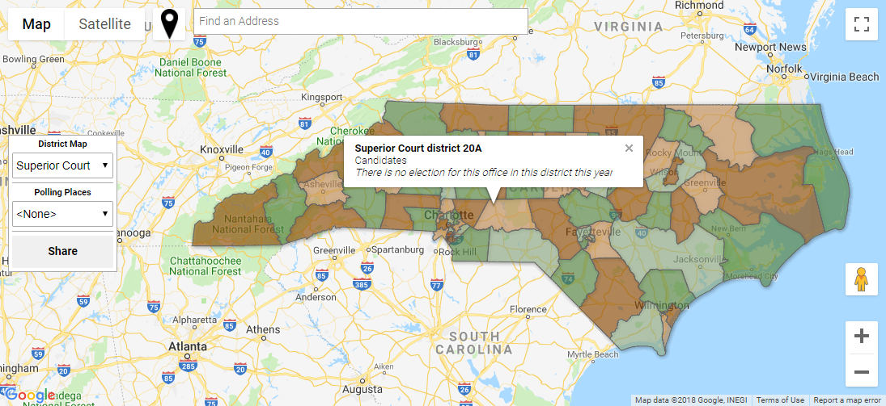

# NC Midterm Election 2018

This project is intended to help people in North Carolina learn about the election this November 6th by presenting the districts according to which the positions up for election are elected as an interactive map and by displaying the name of the district, the candidates up for election for the office or offices pertaining to that district as well as those candidates' party affiliations on the ballot, and other important information in a popup balloon when a user clicks or taps a district.

By presenting this information in an interactive visual manner, I hope that people can become more engaged with politics, as they will be able to observe the boundaries of the districts and determine which districts they live in, which electoral precinct they live in, and even their polling place without having to go out of their way to ask each question.  You don't have to ask "Which Superior Court district do I live in?" or "Is my least favorite barbershop inside the same state senate district as my home?" (not that anyone would ever think to ask that sort thing), and instead you can simply explore the district maps and learn whatever information interests you.

The interactive map can be found here: [https://fiveham.github.io/NC-elections/all-districts](https://fiveham.github.io/NC-elections/all-districts)

## About the Map

The map includes layers for

* State House
* State Senate
* Statewide offices/issues
* Prosecutorial districts (as in "district attorney")
* Congressional districts (US House)
* Counties (local offices not elected countywide are included)
* Superior Court districts
* District Court districts
* Precincts
* Polling Places for November 6
* Early Voting Places

Choose a district map layer and a polling place layer to display from the menu on the left.

### Features

* Maps for every\* district type
    * Learn of offices you maybe didn't know existed!
    * \*Except Soil and Water Conservation districts, whose supervisors are elected per county
* Map view sharing
    * Link to the map so it shows the same view and layers you that were shown when you copied the sharing URL
* URL parameters
    * Link to a [specific location and zoom level](https://fiveham.github.io/NC-elections/all-districts?lat=36.396753&lng=-79.862120&layer=senate&zoom=10) on the map and even choose which layer!
    * (details below)
* Geolocator button
    * Jump to your location and explore the districts around you
* Toggleable Polling Place overlay
* Address search bar
    * Jump to an address and check who's running for what offices around there

### URL Parameters

Six parameters are supported:
* layer
* lat
* lng
* zoom
* pp
* bounds
 
#### layer

`layer` can `=` any of 

* `house`
* `senate`
* `statewide`
* `prosecutorial`
* `congress`
* `county`
* `superior`
* `district`
* `precinct`

This parameter determines the map layer that is displayed when the page loads.

#### lat, lng

`lat` and `lng` can `=` any latitude and longitude respectively and determine the initial latitude and longitude where the map is centered when the page loads.

#### zoom

`zoom` can `=` any integer number from 0 to 22 and determines the initial zoom level when the page loads.

#### pp

If `pp` is set to `early`, then the early voting locations are displayed automatically when the page loads.  If `pp` is set to anything else or is simply present without being set to anything, then the election-day polling places are displayed automatically when the page loads.

#### bounds

`bounds` can `=` a string that looks like this: `ea-79.3378we-80.00401no34.70315so34.0367` made of four boundary terms all squished together in any order. Each boundary term is the first two letters of the boundary's cardinal direction followed by the latitude or longitude of that boundary in degrees.

If `bounds` is specified, then when the map loads it will fit itself to the specified box.  If a center `lat` and `lng` and/or a `zoom` value have also been specified, then they are ignored.

## Warning

This project should not be trusted as the final word on any of the election information that it presents.  Before taking any action based on that information, you should verify it independently from official sources.

To officially determine which districts pertain to you as a voter, if you are already registered to vote, [look up your voter registration information](https://vt.ncsbe.gov/RegLkup/) with the state board of elections.  The "Jurisdictions" section lists all the districts that pertain to you, and the "Sample Ballots" section lists any sample ballots that pertain to you, once they become available.

If you are not registered to vote, you can officially determine which precinct and polling place pertain to you by [looking up your Precinct and Polling Place](https://vt.ncsbe.gov/PPLkup) according to your address.  Polling place lookup results include sample ballots once those are available, which can officially tell you who's running for what.

If you are not registered to vote but you want to be registered, you just need to fill out a [voter registration form (PDF)](https://www.ncsbe.gov/Portals/0/Forms/NCVoterRegForm06W.pdf), physically sign it, and mail it (or deliver it in person) to [your county board of elections.](https://vt.ncsbe.gov/BOEInfo/)

To determine which candidates are running for which offices, sample ballots, once they are available, are naturally an official source for that information.
